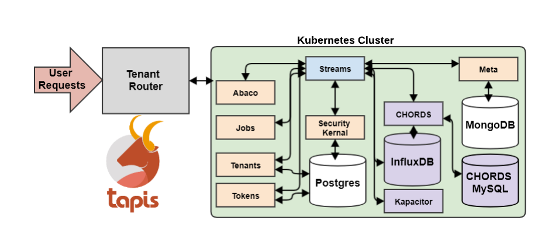

# Streaming Data Collection for Sensor Networks

## Tapis

[Tapis Slide presentation](https://docs.google.com/presentation/d/1WvLGXWgIGMaVLLVm1miT3rY76bx3egaLxpE7mo6fBYY/edit#slide=id.gd1fbb4c590_0_742)

Tapis is a National Science Foundation (NSF) funded web-based API framework for securely managing computational workloads across infrastructures and institutions. The newest iteration, Tapis V3, has several new capabilities, including a multi-site security kernel, streaming data APIs, and high-level support for containerized applications. Tapis provides several APIs for data management and processing. We will be working with the streams API for handling stream style data typical of a sensor network.

## Streams API

Tapis V3 introduces a Streams API for representing physical sensor networks and streaming and handling reported data. The API provides data-driven event support for real-time data coming through the API.



The API is structured into a hierarchy of organizational objects describing the sensor network being represented.

### Projects

This is the broadest organizational structure available in the Streams API. This provides information describing the top level project data collection falls under.

| Property                  | Description                                             | Required  |
| ------------------------- | ------------------------------------------------------- | --------- |
| project_name              | Project name                                            |   true    |
| description               | Project description                                     |   false   |
| owner                     | string: Project owner                                   |   true    |
| pi                        | string: Project principle investigator (project lead)   |   true    |
| funding_resource          | string: Funding source of the project                   |   false   |
| project_url               | string: URL for project online resources                |   false   |
| active                    | boolean: Current status of the project                  |   false   |
| metadata                  | Object: Additional metadata for the project             |   false   |

### Sites

Sites are registered to projects and represent the physical location of the data collection instrumentation.

| Property                  | Description                                             | Required  |
| ------------------------- | ------------------------------------------------------- | --------- |
| project_id                | string: ID of the project this site is associated with  |   true    |
| site_name                 | string: Project Site name                               |   true    |
| site_id                   | string: Site ID                                         |   false   |
| description               | string: Site description                                |   true    |
| latitude                  | number: Site latitude                                   |   true    |
| longitude                 | number: Site longitude                                  |   true    |
| elevation                 | number: Site elevation                                  |   true    |
| metadata                  | Object: Additional metadata for the site                |   false   |

### Instruments

Instruments represent the physical instruments/sensors available at a given site. This is the hardware performing the data collection being monitored.

| Property                  | Description                                                   | Required  |
| ------------------------- | ------------------------------------------------------------- | --------- |
| project_id                | string: ID of the project this instrument is associated with  |   true    |
| site_id                   | string: ID of the site this instrument is located at          |   true    |
| inst_name                 | string: Instrument name                                       |   false   |
| inst_id                   | string: Instrument ID                                         |   false   |
| inst_description          | string: Instrument description                                |   false   |
| topic_category_id         | string: Instrument category                                   |   false   |
| tags                      | string[]: Array of instrument tags                            |   false   |
| metadata                  | Object: Additional metadata for the isntrument                |   false   |

### Variables

Instruments will typically record properties of the environment they are placed in and report out these values. For example, a climatological sensor station may record levels of rainfall, air temperature, and relative humidity for its location. These would each be stored as a variable. The variable objects provide metadata for each of these measured properties.

| Property                  | Description                                                     | Required  |
| ------------------------- | --------------------------------------------------------------- | --------- |
| project_id                | string: ID of the project this variable is associated with      |   true    |
| site_id                   | string: ID of the site this variable's instrument is located at |   true    |
| inst_id                   | string: ID of the instrument this variable is recorded by       |   true    |
| var_id                    | string: Variable ID                                             |   false   |
| var_name                  | string: Variable name                                           |   false   |
| units                     | string: Units variable is measured in                           |   false   |
| measured_property_id      | string: ID of the property measured by this variable type       |   false   |
| shortname                 | string: Short name for the variable                             |   false   |
| metadata                  | Object: Additional metadata for the isntrument                  |   false   |

### Measurements

The final structure in the Streams API is the actual measurments recorded by the instruments. Measurement objects contain all the recorded measurements indexed by variable and the datetime of their recording.

#### Measurement Creation

| Property                  | Description                                                     | Required  |
| ------------------------- | --------------------------------------------------------------- | --------- |
| inst_id                   | string: ID of the instrument this variable is recorded by       |   true    |
| var_id                    | Measurement[]: Measurment definitions                           |   true    |

#### Measurments Definition Object

```gibberish
{
  datetime: string
  [variable_id: string]: number
}
```

#### Measurements Return Object

```gibberish
{
  instrument: Instrument
  site: Site
  measurments_in_file: number
  [variable_id: string]: {
    [datetime: string]: number
  }
}
```


## Abaco Containers

Tapis provides functions-as-a-service (FaaS) through Abaco, which is based on the actor model of concurrent computation and Docker. Users define computational primitives called actors with a Docker image, and Abaco assigns each actor a unique URL over which it can receive messages. Users send the actor a message by making an HTTP POST request to the URL. In response to an actor receiving a message, Abaco launches a container from the associated image, injecting the message into the container. Typically, the container execution is asynchronous from the message request, though Abaco does provide an endpoint for sending a message to an actor and blocking until the execution completes, providing synchronous execution semantics. Abaco maintains a queue of messages for each actor, and is capable of launching containers in parallel for a given actor when the actor is registered as stateless. The functions run with an authenticated context that allows them to make requests to other Tapis APIs to perform actions such as data transfers or job submissions.

Here is an actor we will use today for generating a plot of some of our mock-sensor data and uploading it to Jetstream Virtual Machine https://github.com/scleveland/workshop_actor

## Streams Event Handling

The streams API includes the ability to register and kick off Abaco containers when a measurement hits a defined threshold, sending the measurement definition to the container. Messages sent to the container are stored in an environment variable called MSG. This will allow users to automatically receive notifications or start processing tasks for measurements in real time.
