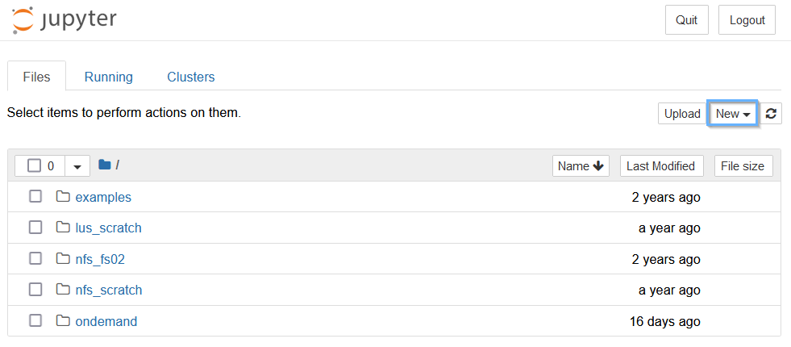
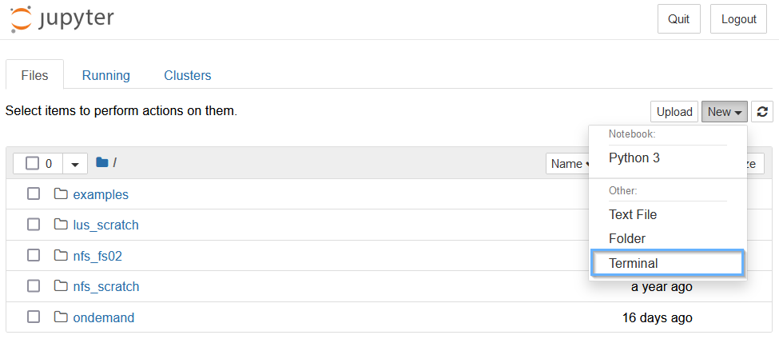
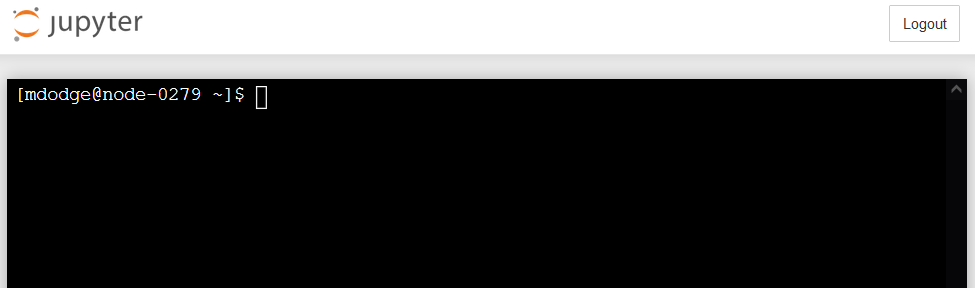
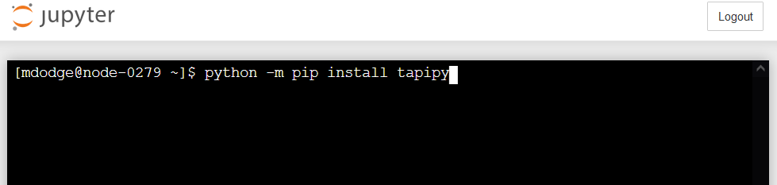
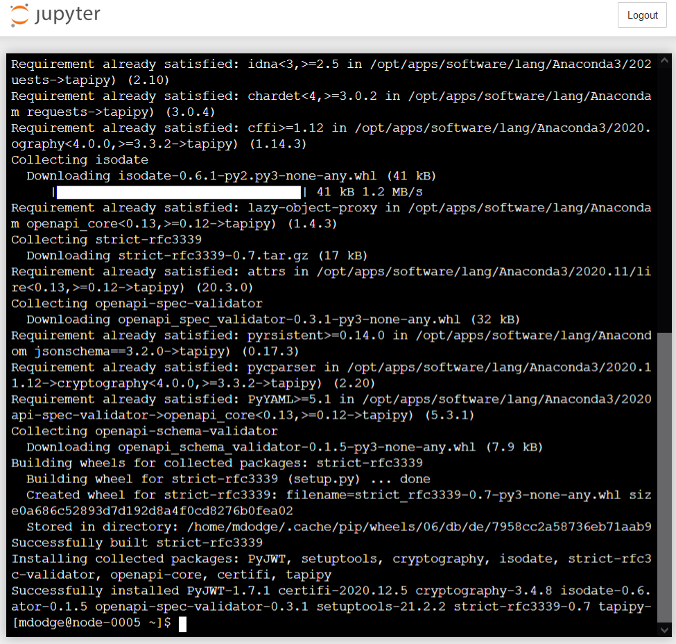
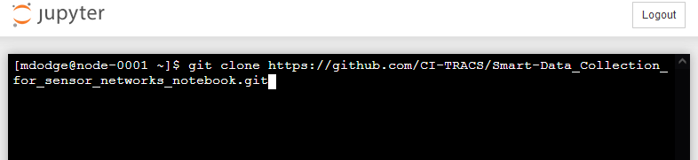
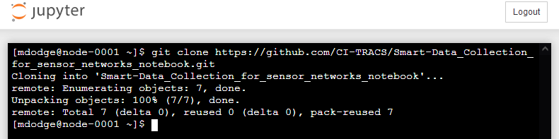
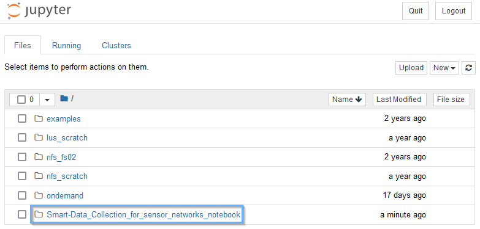
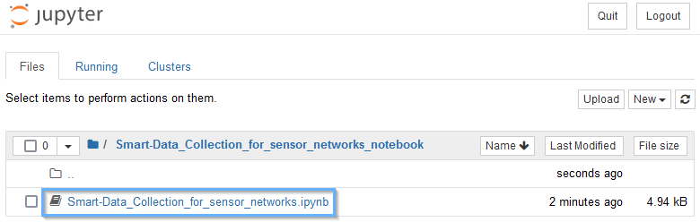
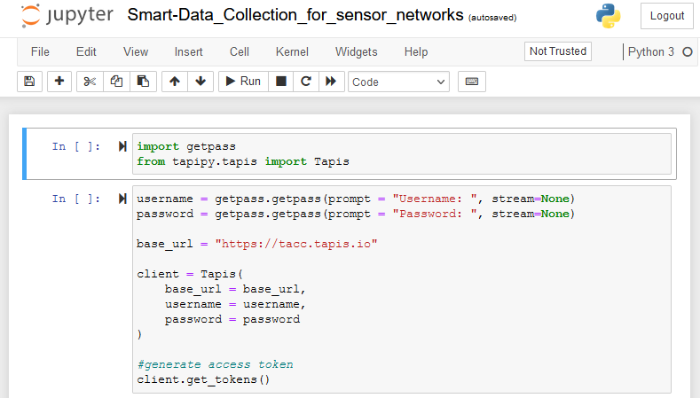

# Installing Dependencies

To install python dependencies, we're going to use the `pip` utility.

First we'll want to open a terminal on the node that our notebook is running on.
To do this, go to the tab where you opened the notebook from, and click "New".
 

Next, click "Terminal" from the drop-down bar.


You should now be brought to a terminal connected to the virtual machine.

> ### Heads-up!
> On your first time using a MANA terminal, it will show a "do you trust this system" prompt, simply type "yes" and enter.
{: .callout}


Now that we have a terminal, it's time to install some python packages!

---

Let's install the `tapipy` package, which includes functions that help us work with the Tapis system.
Run the following command:
```bash
python -m pip install tapipy
```

> #### What this does...
> This runs python and tells it to execute the "pip" module, then tells pip to install tapipy.



When it's done, you should see the following:


# Getting the Notebook

We're going to use `git` to download the latest version of the Jupyter Notebook for this workshop.
Git is an application that helps with collaborative software development.
Its `clone` command allows us to download the entire project folder (called a Repository) in a simple and reproducible manner.

Run the following command:
```bash
git clone https://github.com/CI-TRACS/Smart-Data_Collection_for_sensor_networks_notebook.git
```



It will take a few seconds to load, then you should see the following.



Now, let's get to editing the notebook! 

---

# Editing the Notebook
Now that we've cloned the notebook repository to the `~/Smart-Data_collection_for_sensor_networks_notebook` directory, it's time to go there and open up the notebook.


Go back to the Jupyter Home interface, where you should see a screen like this:


Click `Smart-Data_Collection_for_sensor_networks_notebook` to enter our newly downloaded folder.


The new folder includes our notebook, and any other files we will happen to need.


Finally, click the `Smart-Data_Collection_for_sensor_networks.ipynb` file to open our notebook.


The notebook should now be open, and ready to edit!



